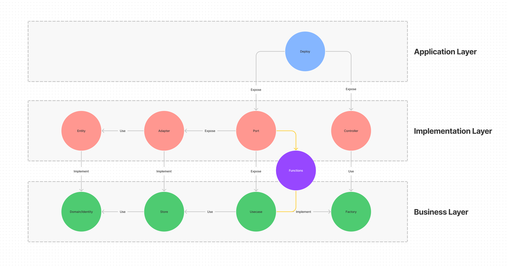

<a name="readme-top"></a>

[![Contributors][contributors-shield]][contributors-url]
[![Forks][forks-shield]][forks-url]
[![Stargazers][stars-shield]][stars-url]
[![Issues][issues-shield]][issues-url]
[![MIT License][license-shield]][license-url]

<!-- PROJECT LOGO -->
<br />
<div align="center">
  <a href="https://github.com/arkitik/radix">
    
  </a>

<h3 align="center">Radix</h3>

  <p align="center">
    Provide the needed infrastructure to build clean Domain-Driven Design (DDD) apps in the Java ecosystem
    <br />
    <a href="https://github.com/arkitik/radix/docs/documentation.md"><strong>Explore the docs »</strong></a>
    <br />
    <br />
    <a href="https://github.com/arkitik/radix/issues">Report Bug</a>
    ·
    <a href="https://github.com/arkitik/radix/issues">Request Feature</a>
  </p>
</div>

<!-- TABLE OF CONTENTS -->
<summary>Table of Contents</summary>
<ol>
<li>
  <a href="#about-the-project">About The Project</a>
</li>
<li>
  <a href="#getting-started">Getting Started</a>
  <ul>
    <li><a href="#prerequisites">Prerequisites</a></li>
  </ul>
</li>
<li><a href="#usage">Usage</a></li>
<li><a href="#roadmap">Roadmap</a></li>
<li><a href="#contributing">Contributing</a></li>
<li><a href="#license">License</a></li>
<li><a href="#contact">Contact</a></li>
<li><a href="#built-with">Built With</a></li>
</ol>


<!-- ABOUT THE PROJECT -->

## About The Project

Radix is a lightweight Kotlin framework that provides a blueprint to build clean, easy-to-maintain, and
highly-scalable server-side components. It emphasizes on the idea of isolating the bussiness logic of the app from 3rd
party dependencies (e.g. Spring) by keeping all core business logic in the usecases layer which makes it easy to expose
different kind of services and even port the app into a different framework.

<div align="center">
  <a href="https://github.com/arkitik/radix">
    
  </a>
</div>

<p align="right">(<a href="#readme-top">back to top</a>)</p>

<!-- GETTING STARTED -->

## Getting Started

Add the below dependency to the project's dependency management:

```xml

<dependency>
    <groupId>io.arkitik.radix</groupId>
    <artifactId>radix-dependencies</artifactId>
    <version>v1.4.1</version>
    <type>pom</type>
    <scope>import</scope>
</dependency>
```

### Prerequisites

* JDK version >= 1.8

<!-- USAGE EXAMPLES -->

## Usage

Let's build a simple `User` domain! To do so, we should start with the abstraction from the identity level and then move
to the implementation.

### 1. Identity:

The identity in simple terms is the abstraction of the entity, it
extends [Identity\<ID : Serializable>][radix-identity-url] and specifies the value of the generic type ID.

```kotlin
interface User : Identity<String> {
    override val uuid: String
    val username: String
    val password: String
}
```

&rarr; it's available through the below dependency:

```xml

<dependency>
    <groupId>io.arkitik.radix</groupId>
    <artifactId>radix-development-identity</artifactId>
</dependency>
```

### 2. Store:

The store is similar to the Data Access Object (DAO) pattern, it allows us to isolate the business layer
from the persistence layer which means you can swap different persistence layers or change the implementation without
affecting the core bussiness of the app! Aside from that, it also provides builders to create/update the entity.

To create our own `UserStore` we should extend from [Store\<ID : Serializable, I : Identity\<ID>>][radix-store-url]

```kotlin
interface UserStore : Store<String, UserIdentity> {
    override fun UserIdentity.save(): UserIdentity
    override val storeQuery: StoreQuery<String, UserIdentity>
    override fun identityCreator(): StoreIdentityCreator<String, UserIdentity>
    override fun UserIdentity.identityUpdater(): StoreIdentityUpdater<String, UserIdentity>
}
```

&rarr; it's available through the below dependency:

```xml

<dependency>
    <groupId>io.arkitik.radix</groupId>
    <artifactId>radix-development-store</artifactId>
</dependency>
```

### 3. Usecase Factory:

The usecase factory allows the consumer to create usecase objects without having to know the details about their
implementation, dependencies, or how they get created.

As a consumer, all you need to know is the signature of the usecase which is basically:

1. What does the usecase do (interpreted from the usecase name).
2. The usecase request.
3. The usecase response.

Let's create our own `UserUsecaseFactory` and add `findUserByUuidUseCase` usecase to it:

```kotlin
interface UserUseCaseFactory : UseCaseFactory {
    val findUserByUuidUseCase: FunctionalUseCase<FindUserRequest, FindUserResponse>
}
```

and the request/response as follows:

```kotlin
data class FindUserRequest(val uuid: String) : UseCaseRequest

data class FindUserResponse(val identity: UserIdentity?) : UseCaseResponse
```

&rarr; it's available through the below dependency:

```xml

<dependency>
    <groupId>io.arkitik.radix</groupId>
    <artifactId>radix-development-usecase</artifactId>
</dependency>
```

### 4. Usecase:

The usecase layer is the brains of the app, the core business logic that your app needs to run and is defined through
contract abstraction in the usecase-factory.

In our case, we have only one factory with one usecase which is `findUserByUuidUseCase`, to implement it we have to
inject the `StoreQuery` available from the `UserStore`.

```kotlin
class FindUserByUuidUseCase(
    private val storeQuery: StoreQuery<String, UserIdentity>,
) : FunctionalUseCase<FindUserRequest, FindUserResponse> {
    override fun FindUserRequest.process() = FindUserResponse(storeQuery.find(uuid))
}
```

and finally the usecase-factory implementation:
```kotlin
class UserUseCaseFactoryImpl(
  userStore: UserStore,
) : BankUseCaseFactory {
  override val findUserByUuidUseCase = FindUserByUuidUseCase(userStore.storeQuery)
}
```
----
Of course, don't forget to provide the implementation for the identity (i.e. entity) and the store (i.e. adapter).
For more examples, please refer to the [Documentation][radix-documentation-url].

<p align="right">(<a href="#readme-top">back to top</a>)</p>

<!-- ROADMAP -->

## Roadmap

- [ ] Complete the [Documentation][radix-documentation-url] files
    - [ ] Business Layer
    - [ ] Implementation Layer
    - [ ] Application Layer

See the [open issues](https://github.com/arkitik/radix/issues) for a full list of proposed features (and known issues).

<p align="right">(<a href="#readme-top">back to top</a>)</p>

<!-- CONTRIBUTING -->

## Contributing

Contributions are what make the open source community such an amazing place to learn, inspire, and create. Any
contributions you make are **greatly appreciated**.

If you have a suggestion that would make this better, please fork the repo and create a pull request. You can also
simply open an issue with the tag "enhancement".
Don't forget to give the project a star! Thanks again!

1. Fork the Project
2. Create your Feature Branch (`git checkout -b feature/AmazingFeature`)
3. Commit your Changes (`git commit -m 'Add some AmazingFeature'`)
4. Push to the Branch (`git push origin feature/AmazingFeature`)
5. Open a Pull Request

<p align="right">(<a href="#readme-top">back to top</a>)</p>

<!-- LICENSE -->

## License

Distributed under the Apache License 2.0. See [LICENSE][license-url] for more information.

<p align="right">(<a href="#readme-top">back to top</a>)</p>

<!-- CONTACT -->

## Contact

[Ibrahim Al-Tamimi](https://github.com/ibm-iloom) - <a href = "mailto:ibm.iloom@gmail.com">ibm.iloom@gmail.com</a>

Project Link: [https://github.com/arkitik/radix](https://github.com/arkitik/radix)

<p align="right">(<a href="#readme-top">back to top</a>)</p>

<!-- BUILT WITH -->

### Built With

[![Kotlin][Kotlin-shield]][kotlin-url]
[![Maven][maven-shield]][maven-url]

<p align="right">(<a href="#readme-top">back to top</a>)</p>

<!-- MARKDOWN LINKS & IMAGES -->

[contributors-shield]: https://img.shields.io/github/contributors/arkitik/radix.svg?style=for-the-badge

[contributors-url]: https://github.com/arkitik/radix/graphs/contributors

[forks-shield]: https://img.shields.io/github/forks/arkitik/radix.svg?style=for-the-badge

[forks-url]: https://github.com/arkitik/radix/network/members

[stars-shield]: https://img.shields.io/github/stars/arkitik/radix.svg?style=for-the-badge

[stars-url]: https://github.com/arkitik/radix/stargazers

[issues-shield]: https://img.shields.io/github/issues/arkitik/radix.svg?style=for-the-badge

[issues-url]: https://github.com/arkitik/radix/issues

[license-shield]: https://img.shields.io/github/license/arkitik/radix.svg?style=for-the-badge

[license-url]: https://github.com/arkitik/radix/blob/master/LICENSE

[Kotlin-shield]: https://img.shields.io/badge/kotlin-000000?style=for-the-badge&logo=kotlin&logoColor=purple

[kotlin-url]: https://kotlinlang.org/

[maven-shield]: https://img.shields.io/badge/maven-000000?style=for-the-badge&logo=apachemaven&logoColor=red

[maven-url]: https://maven.apache.org/

[radix-documentation-url]: https://github.com/arkitik/radix/docs/documentation.md

[radix-identity-url]: ./radix-development/radix-development-identity/src/main/java/io/arkitik/radix/develop/identity/Identity.kt

[radix-store-url]: ./radix-development/radix-development-store/src/main/java/io/arkitik/radix/develop/store/Store.kt
